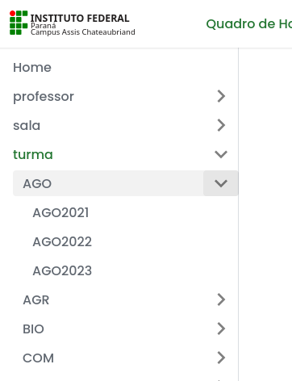

# Home

  Seja bem-vindo ao novo sistema web para o quadro de horários do Instituto Federal do Paraná - Campus Assis Chateaubriand. 

# Changelog: Horários IFPR Assis Chateaubriand - Versão 2025.2.2 (04/08/2025)

Este documento detalha as alterações nos horários das aulas entre a versão `2025.2.1` e a `2025.2.2`, publicada para o segundo semestre de 2025. As modificações visam otimizar a alocação de salas, ajustar a carga horária de professores e formalizar a entrada de novos docentes.

## 📝 Resumo das Alterações

As principais mudanças nesta versão incluem:

*   **Substituição de Professores:** O Prof. **Andrey Felipe Martins** e a Profa. **Michelli Cristina Galli** assumiram diversas aulas de Língua Portuguesa e Língua Inglesa, anteriormente ministradas pelos professores Yohana Diel Saheli e Pedro Leites Junior.
*   **Alocação de Novo Docente:** O Prof. **Mario Eduardo de Barros Gomes Nunes da Silva** foi alocado para as disciplinas de Eletroeletrônica e Automação, substituindo a marcação "Novo professor Automação" e assumindo algumas aulas do Prof. Wylliam Gongora.
*   **Ajustes de Horários e Salas:** Foram realizados diversos pequenos ajustes nos dias, horários e salas de aula para otimizar a logística do campus e do CR Toledo.
*   **Novas Atividades:** Foram adicionadas algumas atividades, incluindo aulas de apoio EAD e aulas para o curso de Formação Inicial e Continuada (FIC).

---

## 🔄 Alterações Detalhadas em Aulas Existentes

As seguintes aulas foram modificadas em termos de professor, horário ou sala.

### Trocas e Alocações de Professores

#### Professor(a) Andrey Felipe Martins
Assumiu um novo conjunto de disciplinas, reorganizando as aulas de Língua Inglesa e Portuguesa.
*   **Língua Estrangeira - Inglês (AGO2025):** Assumiu a disciplina, anteriormente com a Profa. Yohana Diel Saheli. O horário foi alterado de Terça-feira (15:05 - 16:45) para **Segunda-feira (15:05 - 16:45)**.
*   **Língua Estrangeira Moderna 1 - Inglês (EIN2024):** Assumiu a disciplina, anteriormente com a Profa. Yohana Diel Saheli.
*   **Língua Estrangeira Moderna 2 - Inglês (EIN2023):** Assumiu a disciplina, anteriormente com a Profa. Yohana Diel Saheli.
*   **Língua Portuguesa e Literatura I (AGO2025):** Assumiu a disciplina, anteriormente com o Prof. Pedro Leites Junior. O horário foi alterado de Terça-feira para **Quinta-feira (07:30 - 09:10)**.
*   **Língua Portuguesa e Literatura II (IIW2024A):** Assumiu a disciplina, anteriormente com a Profa. Yohana Diel Saheli.
*   **Língua Portuguesa e Literatura III (AGO2023):** Assumiu a disciplina, anteriormente com o Prof. Pedro Leites Junior.
*   **Língua Portuguesa e Literatura III (IIW2023A):** Assumiu a disciplina, anteriormente com a Profa. Yohana Diel Saheli.
*   **Língua estrangeira - Inglês (IIW2025A):** Assumiu a disciplina, anteriormente com a Profa. Yohana Diel Saheli. O horário foi movido de Segunda-feira (13:10 - 14:50) para **Terça-feira (09:25 - 11:05)**.

#### Professor(a) Kátia Cristiane Kobus Novaes
Assumiu aulas de Língua Portuguesa, realocando horários.
*   **Língua Portuguesa e Literatura I (IIW2025A):** Assumiu a disciplina, anteriormente com o Prof. Pedro Leites Junior. O horário foi alterado de Quarta-feira (manhã) para **Segunda-feira (13:10 - 14:50)**.
*   **Língua Portuguesa e Literatura II (AGO2024):** Assumiu a disciplina, anteriormente com o Prof. Pedro Leites Junior.

#### Professor(a) Michelli Cristina Galli
Assumiu aulas de Língua Portuguesa.
*   **Língua Portuguesa e Literatura I (AGO2025):** Assumiu a disciplina, anteriormente com o Prof. Andrey Felipe Martins.
*   **Língua Portuguesa e Literatura II (AGO2024):** Assumiu a disciplina, anteriormente com a Profa. Kátia Cristiane Kobus Novaes.
*   **Língua Portuguesa e Literatura III (AGO2023):** Assumiu a disciplina, anteriormente com o Prof. Andrey Felipe Martins.

#### Professor Mario Eduardo de Barros Gomes Nunes da Silva
Foi formalmente alocado nas disciplinas da área de Eletroeletrônica e Automação.
*   **Acionamentos Elétricos (ELE2024):** Assumiu a disciplina, anteriormente com o Prof. Wylliam S. Gongora e "Novo professor Automação".
*   **Manutenção Elétrica Industrial (ELE2024):** Assumiu a disciplina, anteriormente com "Novo professor Automação" e Prof. Danilo H. Micheletti. O horário foi ajustado de Quarta-feira (19:00 - 20:40) para **Quarta-feira (21:00 - 22:40)**.
*   **Sistemas Digitais (ELE2025+ELM2025):** Assumiu a disciplina, anteriormente com o Prof. Jair Fajardo Junior e "Novo professor Automação".

#### Eliana Peliçon Pereira Figueira e Gabriele Antico Freiria
*   **Biologia (Integrado):** Houve uma reorganização na divisão das aulas entre as professoras para as turmas de **EIN2025, EIN2022, COM2025, AGO2023 e COM2023**.

### Outros Ajustes de Horário e Sala

*   **Geografia I (COM2024)** - Prof. Alexandre Roberto Valcarenghi: A aula de Terça-feira foi movida de `11:05 - 11:55` para **`07:30 - 08:20`**.
*   **História I (COM2024)** - Prof. André Alexandre Valentini: As aulas foram movidas de Sexta-feira (09:25 - 11:05) para **Quarta-feira (10:15 - 11:55)**.
*   **Química II (AGO2024)** - Prof. Antonio Cesar Godoy: A sala foi alterada de `Sala 13-2` para **`Laboratório de Química`**.
*   **Culturas II (AGO2023)** - Prof. Diego Armando Amaro da Silva: O horário de Sexta-feira (09:25 - 10:15) foi alterado para **Terça-feira (11:05 - 11:55)**.
*   **Conservação de Recursos Naturais (ELE2024)** - Prof. Danilo Hungaro Micheletti: O horário foi ajustado de Quarta-feira (21:00 - 22:40) para **Quarta-feira (19:00 - 20:40)**.
*   **Agroecologia e Desenvolvimento Rural (AGO2025)** - Profa. Fernanda da Silva Ferreira: As aulas foram movidas de Quinta-feira (07:30 - 09:10) para **Terça-feira (07:30 - 09:10)**.
*   **Educação Postural (AGO2025)** - Profa. Fernanda da Silva Ferreira: A aula foi movida de Sexta-feira para **Quinta-feira (09:25 - 10:15)**.
*   **Horticultura (AGO2023)** - Profa. Fernanda da Silva Ferreira: O horário foi ajustado de Segunda-feira (13:10 - 14:50) para **Segunda-feira (14:00 - 15:55)**.
*   **Sociologia II (IIW2023A)** - Prof. Everaldo Lorensetti: O horário foi ajustado de Terça-feira (09:25 - 10:15) para **Quarta-feira (11:05 - 11:55)**.
*   **Filosofia I (AGO2025)** - Prof. José Provetti Júnior: As aulas foram movidas de Quinta-feira (09:25 - 10:15) e Sexta-feira (08:20 - 09:10) para **Sexta-feira (07:30 - 09:10)**.
*   **Filosofia II (AGO2024)** - Prof. José Provetti Júnior: O horário foi alterado de Segunda-feira para **Quinta-feira (09:25 - 10:15)**.
*   **Filosofia III (IIW2023A)** - Prof. José Provetti Júnior: O horário foi ajustado de Terça-feira (10:15 - 11:05) para **Quarta-feira (10:15 - 11:05)**.
*   **Artes I (AGO2025)** - Profa. Josiane Paula Maltauro: As aulas foram movidas de Segunda-feira (15:05 - 16:45) para **Terça-feira (15:05 - 16:45)**.
*   **Produção Animal I (AGO2024)** - Profa. Leiliane Cristine de Souza: O horário de Quinta-feira foi movido para **Segunda-feira (11:05 - 11:55)**.
*   **Sociologia I (IIW2025A)** - Prof. Olavo Henrique Vieira Veiga: O horário de Sexta-feira foi ajustado de `11:05 - 11:55` para **`09:25 - 10:15`**.
*   **Sociologia I (AGO2025)** - Prof. Olavo Henrique Vieira Veiga: O horário foi ajustado de Sexta-feira (09:25 - 10:15) para **Sexta-feira (11:05 - 11:55)**.
*   **Química II (IIW2024A)** - Profa. Sabrina Kerkhoff: A sala foi alterada de `Laboratório de Química` para **`Sala 16-2`**.
*   **Química II (COM2024)** - Profa. Sabrina Kerkhoff: As aulas foram movidas de Quarta-feira (10:15 - 11:55) para **Sexta-feira (09:25 - 11:05)**.
*   **Prototipação de Interfaces (IIW2023A)** - Prof. Samuel S. Milczuk e Álvaro J. de Almeida Araújo: As aulas foram movidas de Quarta-feira para **Terça-feira (09:25 - 11:05)**.
*   **História II (AGO2023)** - Profa. Suzane C. P. Tostes: O horário foi ajustado de Segunda-feira (15:05 - 15:55) para **Segunda-feira (13:10 - 14:00)**.
*   **Linguagens de Apresentação (IIW2025A)** - Prof. Álvaro José de Almeida Araújo: O horário de Terça-feira foi movido para **Quarta-feira (10:15 - 11:55)**.
*   **Apoio Presencial EAD (EADSP2025, Alexandre R. Monge):** Os dias foram alterados de Quinta e Terça para **Terça e Quarta**.
*   **Atividades FAO2025-1:** As aulas do Prof. Elias Franco e outros foram movidas de Quinta-feira para **Terça-feira**, e as aulas da Profa. Suzane Tostes foram movidas de Terça-feira para **Quinta-feira**.

---

## 🚀 Novas Atividades Adicionadas

As seguintes atividades foram incluídas na grade horária.

*   **(BIO_ESPECIAL_1) - Política educacional: organização da educação brasileira - 90:** Prof. Jael dos Santos, Segunda-feira, 19:00 - 20:40 na Sala 8-2.
*   **(ERER2025 - Modulo 2) - Educação para Relações Étnico-raciais:** Profa. Celina de Oliveira Barbosa Gomes (UAB), Quarta-feira, 19:00 - 22:40.
*   **(ERER2025 - Modulo 4) - Práticas de ensino para as Relações Étnico-raciais:** Prof. José Jurandir Pereira Junior (UAB), Segunda-feira, 19:00 - 22:40.

---

## 🗑️ Atividades Removidas

As seguintes atividades, presentes na versão `2025.2.1`, não constam mais na versão `2025.2.2`. A maioria refere-se a disciplinas cujos professores foram realocados.

*   Todas as aulas anteriormente atribuídas aos professores **Yohana Diel Saheli** e **Pedro Leites Junior** foram redistribuídas para outros docentes.
*   A marcação de professor **"Novo professor Automação"** foi removida e substituída pelo Prof. **Mario Eduardo de Barros Gomes Nunes da Silva**.

---

## Histórico

| Versão                              |   Início   |    Fim     |
| ----------------------------------- | :--------: | :--------: |
| 2025.2.v2                           | 04/08/2025 |   Atual    |
| [2025.2.v1](/docs/2025.2.1/intro)   | 29/07/2025 | 03/08/2025 |
| [2025.1.v8](/docs/2025.1.8/intro)   | 25/05/2025 | 28/07/2025 |
| [2025.1.v7](/docs/2025.1.7/intro)   | 12/05/2025 | 24/05/2025 |
| [2025.1.v6](/docs/2025.1.6/intro)   | 20/04/2025 | 11/05/2025 |
| [2025.1.v5](/docs/2025.1.5/intro)   | 16/03/2025 | 19/04/2025 |
| [2025.1.v4](/docs/2025.1.4/intro)   | 09/03/2025 | 15/03/2025 |
| [2025.1.v3](/docs/2025.1.3/intro)   | 23/02/2025 | 08/03/2025 |
| [2025.1.v2](/docs/2025.1.2/intro)   | 16/02/2025 | 22/02/2025 |
| [2025.1.v1](/docs/2025.1.1/intro)   | 09/02/2025 | 15/02/2025 |
| [2024.2.v7](/docs/2024.2.7/intro)   | 17/11/2024 | 31/12/2024 |
| [2024.2.v6](/docs/2024.2.6/intro)   | 10/11/2024 | 16/11/2024 |
| [2024.2.v5](/docs/2024.2.5/intro)   | 20/10/2024 | 09/11/2024 |
| [2024.2.v4](/docs/2024.2.4/intro)   | 29/09/2024 | 19/10/2024 |
| [2024.2.v3](/docs/2024.2.3/intro)   | 15/09/2024 | 28/09/2024 |
| [2024.2.v2](/docs/2024.2.2/intro)   | 08/09/2024 | 14/09/2024 |
| [2024.2.v1](/docs/2024.2.1/intro)   | 25/08/2024 | 07/09/2024 |
| [2024.1.v11](/docs/2024.1.11/intro) | 28/07/2024 | 24/08/2024 |
| [2024.1.v10](/docs/2024.1.10/intro) | 21/07/2024 | 27/07/2024 |
| [2024.1.v9](/docs/2024.1.9/intro)   | 15/07/2024 | 20/07/2024 |
| [2024.1.v8](/docs/2024.1.8/intro)   | 07/07/2024 | 14/07/2024 |
| [2024.1.v7](/docs/2024.1.7/intro)   | 30/06/2024 | 06/07/2024 |
| [2024.1.v6](/docs/2024.1.6/intro)   | 24/03/2024 | 29/06/2024 |
| [2024.1.v5](/docs/2024.1.5/intro)   | 18/03/2024 | 23/03/2024 |
| [2024.1.v4](/docs/2024.1.4/intro)   | XX/XX/2024 | XX/XX/2024 |
| [2024.1.v3](/docs/2024.1.3/intro)   | XX/XX/2024 | XX/XX/2024 |
| [2024.1.v2](/docs/2024.1.2/intro)   | XX/XX/2024 | XX/XX/2024 |
| [2024.1.v1](/docs/2024.1.1/intro)   | XX/XX/2024 | XX/XX/2024 |

## Novidades

17/02/2024: Tabela de versões e mudanças.

23/jul/2023: Organização da Turma por Cursos e das Salas por Prédios

12/fev/2023: Ferramenta de busca

01/fev/2023: Versão "Em desenvolvimento" para planejamento de trocas e proxímas atualizações

## Novas funcionalidades

- Menu lateral para melhorar sua navegação.
- Fácil acesso ao horário de qualquer professor, turma, ou sala de aula.
- Tema claro e escuro.
- Configure o seu próprio horário escolhendo a forma como quer seja exibido.
  - Completo (Padrão): Será exibido o horário das aulas de todos os dias das 07:30 até as 22:40.
  - Condensado: Será exibido o horário entre a primeira e última aula, sem tirar os espaços vago.
  - Super condensado: Será exibido o horário entre a primeira e última aula, tirando os dias que não possui aula e os espaços vago.
- A cada alteração no horário será criado uma nova versão e armazenada. Sendo assim, você consegue visualizar até os horários antigo.
- Foto do horário por completo (Disponível apenas para dispositivos Android e Desktop).
